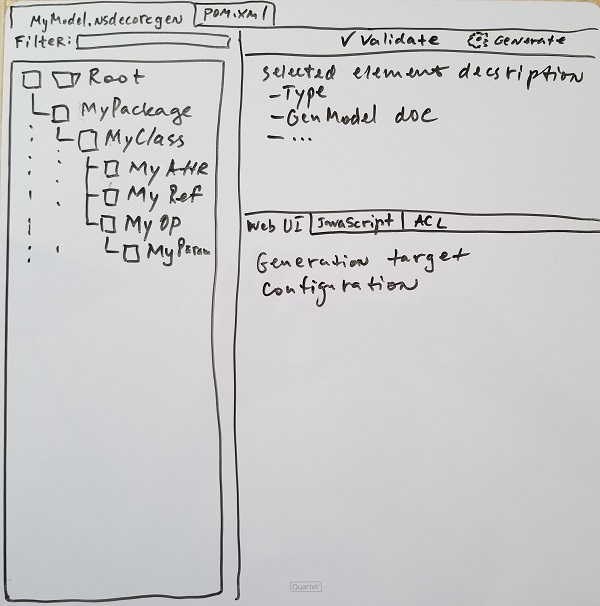

# ECore Code Generation

Those working with Eclipse EMF Ecore models are familiar with the Ecore code generation editors and process:

* The Ecore model contains the model definition - packages, classifiers, structural features, operations, etc.
* The generator model contains additional information required for code generation - java package names, names of base classes, ...
* There are four "generation targets"
  * Model
  * Edit support
  * Editor
  * Tests
  
The goal of this project is to extend the code generation concepts in the following ways:

* Allow users to select a sub-set of model elements for which to generate code.
* Generation targets can be contributed to the UI through the Eclipse extensions mechanism and a set of generation targets of interest is selected by a user at the generator model creation time.   

## Usage scenarios

### Web UI generation

A server application is using a domain model stored in CDO repository. There is a need to create a web page (e.g. a single-page application) dealing with a particular aspect of the model. 
For example, display a list of customer accounts with balances in a table.

In this case a developer would create a generator model with the application domain model as input and Web UI generation target.
Then they would select domain model elements which participate in the user story they are implementing - display a list of customer accounts. 
In essence, they would define a bounded context for their "micro-app". 

After that they would configure Web UI generation for selected domain elements, e.g. select whether to use a drop-down or radio-buttons for value selection.

Once everything is configured the developer would validate the generator model and then generate code for selected targets.

## Concepts

* Code generator model
  * Root element - keeps a list of EPackages included in the model and a list of generation targets.
  * Model elements - reference Ecore model elements - packages, classifiers, ... Generator model elements keep track of element Ecore model elements selection and contain configuration elements for the model element.
* Generator target is an extension point which defines a name of the target and an implementation class which performs actual generation.
* The target generator class has a method which creates configuration elements contained in the generation model.
* The target generator also has a method selecting model elements supported by the target. Only model elements supported by at least one target are displayed in the tree view.   
* Configuration elements are displayed in the tab view in the right bottom of the editor.

 

## Creating a model

A model is created with a wizard. User selects EPackages and generation targets.

## Editing the model

* Select Ecore elements to be included in the generation process.
* Fill out configuration forms for elements.
* Validate the model.

## Generating code

* Right-click on the model root or other model element and select "Generate". Or click on the generator icon in the form editor. 
* Enter values for unbound properties to a dialog when requested.

If the project containing the generation model is a Java project, then Java classes defined in the project or referenced by the project are available in the generators context class loader.

## API Documentation

* [Model](http://www.nasdanika.org/products/codegen-ecore/apidocs/org.nasdanika.codegen.ecore/apidocs/)
* [Edit](http://www.nasdanika.org/products/codegen-ecore/apidocs/org.nasdanika.codegen.ecore.edit/apidocs/)
* [Editor](http://www.nasdanika.org/products/codegen-ecore/apidocs/org.nasdanika.codegen.ecore.editor/apidocs/)

## P2 Repository

* ``http://www.nasdanika.org/products/codegen-ecore/repository``
* [Archived](http://www.nasdanika.org/products/codegen-ecore/org.nasdanika.codegen.ecore.repository-0.1.0-SNAPSHOT.zip)

## Examples

* https://github.com/Nasdanika/codegen-examples
 
## Roadmap

* Generation target definition
  * Interface
  * Extension point
* Modify the model wizard
  * Select source EPackages - from the registered packages, target platform, workspace packages, URL's
  * Select generation targets - from extension points
* Form editors
  * Registered with extension points
  * Different levels:
    * EClassifier
    * EStructuralFeature
    * EOperation
    * EParameter
    * ... 
  * Default implementations leveraging ``org.eclipse.emf.edit.ui.provider.PropertyDescriptor.createPropertyEditor()``
  * Context help for form elements generated from model documentation annotations.
* Code generation dialog - selection of targets, remembering last using targets in the model.

## How to contribute

As an open source project we use the [Fork and Pull Model](https://help.github.com/articles/about-collaborative-development-models/).
You can find more information about collaborative development at GitHub in this article - [Collaborating with issues and pull requests](https://help.github.com/categories/collaborating-with-issues-and-pull-requests).

When you contribute code, please make sure that the changes are clearly identifiable. In particular, avoid making non-functional changes in the code which you do not touch, 
e.g. auto-formatting of an entire compilation unit. 

