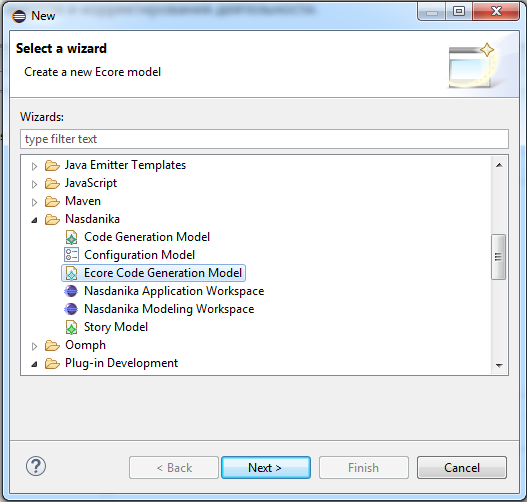
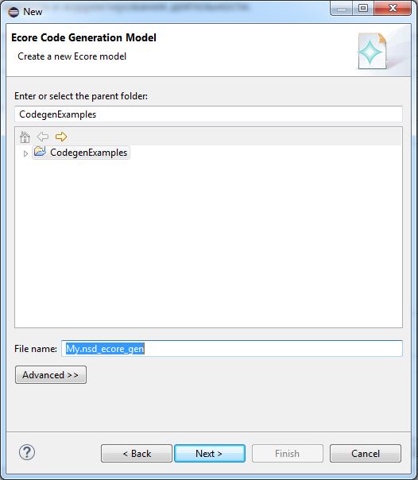
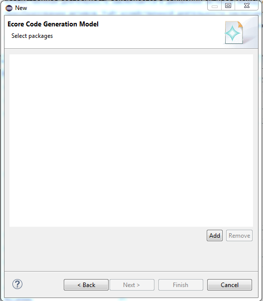
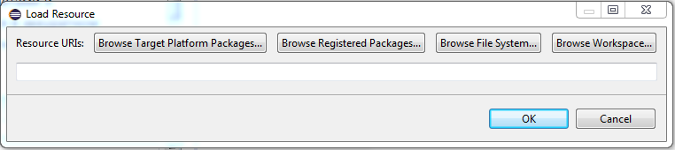
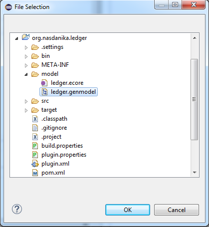
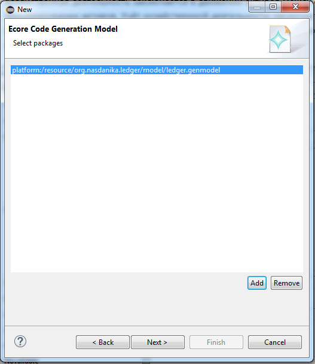
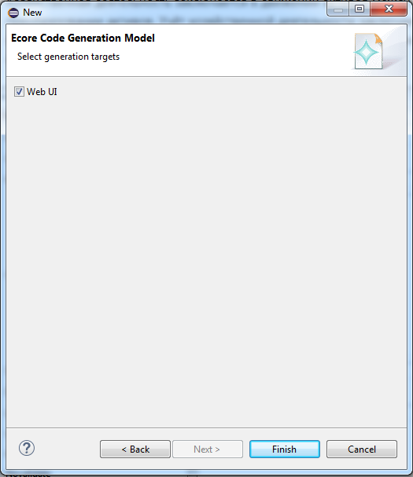
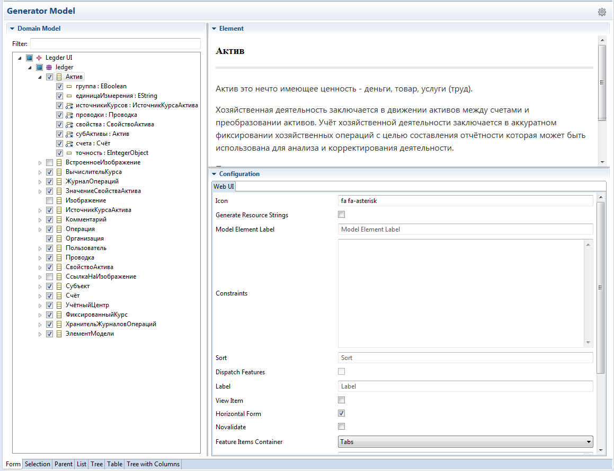

# Ecore Code Generation

Those working with Eclipse EMF Ecore models are familiar with the Ecore code generation editors and process:

* The Ecore model contains the model definition - packages, classifiers, structural features, operations, etc.
* The generator model contains additional information required for code generation - java package names, names of base classes, ...
* There are four "generation targets"
  * Model
  * Edit support
  * Editor
  * Tests
  
Nasdanika Ecore Code Generation extends the code generation concepts in the following ways:

* Allows users to select a sub-set of model elements for which to generate code.
* Generation targets can be contributed to the UI through the Eclipse extensions mechanism and a set of generation targets of interest is selected by a user at the generator model creation time. 

## Concepts

* Code generator model
  * Root element - keeps a list of EPackages included in the model and a list of generation targets.
  * Model elements - reference Ecore model elements - packages, classifiers, ... Generator model elements keep track of element Ecore model elements selection and contain configuration elements for the model element.
* Generator target is an extension point which defines a name of the target and an implementation class which performs actual generation.
* The target generator class has a method which creates configuration elements contained in the generation model.
* The target generator also has a method selecting model elements supported by the target. Only model elements supported by at least one target are displayed in the tree view.   
* Configuration elements are displayed in the tab view in the right bottom of the editor.

## Creating a model

_Please keep in mind that you need to install at least one generation target in order to use the editor!_

Select "File > New > Other" and then "Nasdanika / Ecore Code Generation Model":

Click "Next" and select parent folder and file name:

Click "Next" and select source EPackages:

Click "Next" and select generation targets:

Click "Finish".  

## Editing the model

* Select Ecore elements to be included in the generation process.
* Fill out configuration forms for elements.

Configuration forms perform live validation of input. Also the model is validated before generation.

## Generating code

* Select the model root in the tree. 
* Click the cog icon in the top right cornder of the editor.

## Usage scenario

### Web UI generation

This scenario is shown in the screenshots above.

A server application is using a domain model stored in CDO repository. There is a need to create a set of web pages dealing with a particular aspect of the model. 

In this case a developer would create a generator model with the application domain model as input and Web UI generation target.
Then they would select domain model elements which participate in the user stories they are implementing. 
In essence, they would define a bounded context for their application. 

After that they would configure Web UI generation for selected domain elements, e.g. select whether to use a select or radio-buttons for value selection.

Once everything is configured the developer would generate code for selected targets.

## API Documentation

* [Model](http://www.nasdanika.org/products/codegen-ecore/apidocs/org.nasdanika.codegen.ecore/apidocs/)
* [Edit](http://www.nasdanika.org/products/codegen-ecore/apidocs/org.nasdanika.codegen.ecore.edit/apidocs/)
* [Editor](http://www.nasdanika.org/products/codegen-ecore/apidocs/org.nasdanika.codegen.ecore.editor/apidocs/)

## Example

``Ledger.nsd_ecore_gen`` in [Nasdanika Leder App Project](https://github.com/Nasdanika/ledger/tree/master/org.nasdanika.ledger.app).
